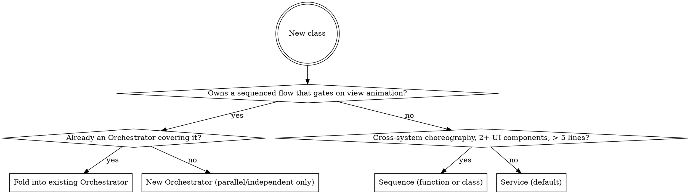

# Minigame Convention

A code-level contract for TypeScript projects where each minigame is a scene inside a larger app: gameplay flow reads top-to-bottom in one method, animation gating is explicit, and the communication mechanism is decided by a litmus test. (High-level component overview lives in the `minigame-architecture` skill; this skill is the code-level structure + communication contract.)

## Mental model — "mutate down, await across, broadcast out"

Every consequence of a game event is one of **three kinds**, and the kind dictates the mechanism. Conflating them is the root mistake — it is what produces EventBus spaghetti.

| Kind | Examples | Mechanism |
|---|---|---|
| **1. Authoritative state** | `+score`, `+coins`, `−hp`, "did we win", place a piece | **Mutate down** — inline, synchronous, in the Orchestrator. No hook, no bus. Source of truth. |
| **2. Ordered presentation** | clear animation, level-up popup, coin flight, death FX, frame-matched SFX | **Await across** — an awaited delegate **hook**. Single-cast; the Orchestrator owns the timing. |
| **3. Independent cross-cutting** | achievements, quest progress, analytics, telemetry | **Broadcast out** — `bus.emit(Fact)`: sync, `void`, fire-and-forget, anonymous audience. |

**Default bias: presentation is a delegate hook; the event bus is the exception you must justify with "anonymous / arbitrary-N audience."**

## Litmus test — classify any new consequence

```
New consequence
│
├─ Q1. Mutates AUTHORITATIVE game state (score, hp, position, "won?")?
│      └─ YES ⇒ KIND 1: write it inline in the Orchestrator. Stop.
├─ Q2. Producer reads a RETURN VALUE to branch?
│      └─ YES ⇒ DECISION GATE: should<X>?: (d) => Promise<T>   (consumer can veto)
├─ Q3. Producer must WAIT for a side effect before the next step the player SEES?
│      └─ YES ⇒ COMPLETION GATE: await onWill<X>? / onDid<X>?
└─ Q4. Not waiting — audience NAMED/small or ANONYMOUS/arbitrary-N?
       ├─ Named, small ⇒ NOTIFICATION hook: void onDid<X>?
       └─ Anonymous, arbitrary N ⇒ EVENT BUS: bus.emit(Fact)
```

The blade most often gotten wrong: **`await` does not decide delegate-vs-bus** — it decides *within* delegate (a completion gate awaits, a notification does not). **Audience** decides delegate-vs-bus: named-and-known ⇒ hook; anonymous ⇒ bus. A coin-flight or quest popup is a *named* presentation consumer → a **hook**, never a bus event, even though it is "just a notification." If you ever feel you must `await` a `bus.emit`, that is the litmus telling you it was a delegate.

## The communication contract

Logic talks to the view through **optional past-tense hook fields on the producer** that the view *binds*. Two rules carry most of the weight:

- **Hook fields, not a view-implemented interface and not imperative calls.** Logic exposes `onLinesCleared?: (d) => Promise<void>`; the view binds it and decides its own reaction. There is no `GameView` interface the Orchestrator calls, and no `flyCoins()`/`animatePops()` method on the producer. The hook field's signature *is* the port.
- **Name for what the producer DID, never what the view should do.** `onCoinsAdded`, `onUnitDied` ✅ — `flyCoins`, `showPopup` ❌. Future tense (`should…` veto, `will…` pre-mutation) is correct only for genuine gates.

Four tiers — `should…` (decision gate), `onWill…`/`onDid…` awaited (completion gate), `onDid…` `void` (notification), and data-source queries (pull, not push). Completion gate and notification share the same field type; only the call site (`await` vs `void`) differs. **Full tier table, payload rules, fan-out, bind/unbind lifecycle, and re-entrancy → `references/communication.md`.**

## Roles — where a class goes

Three roles. **Default to Service when in doubt** — promotion is easy, demotion painful.

| Role | Owns | How many |
|---|---|---|
| **Service** | state + queries + standalone state-change hooks + data-source queries | many (wallet, board, tray, quest, booster) |
| **Sequence** | one-shot cross-system choreography; no state, no hooks of its own | a few; inline if ≤ 5 lines AND ≤ 2 UI components |
| **Orchestrator** | a sequenced gameplay flow that gates on view animation | usually 1; 0 if feedback is purely cosmetic |



**Hook ownership — Service or Orchestrator?** Not "who owns the state" but "does the Orchestrator's next logic step depend on the view finishing this moment?" Yes → the Orchestrator owns the gating hook and queries the Service synchronously. No → the Service owns a standalone hook only views bind. Never double-emit one moment from both.

## Folder shape

```
games/<gameName>/
├── <Game>Scene.ts    # composition root: instantiate + wire + teardown
├── logic/            # headless — NO engine imports (core/ + one folder per meta Service)
├── view/             # engine-side: animations, UI, sound (mirrors logic; + sequences/)
├── config/
└── index.ts
```

Everything is **per-Scene** — created in the composition root, torn down on shutdown. **No singletons inside a game folder**; cross-game persistent data is injected from a project-level store. (A `Game` app singleton, as in `minigame-architecture`, is an allowed shell *outside* the folder, not an in-folder service locator.) **Full annotated tree + key skeleton code (Orchestrator, Service, View bind/unbind, Sequence, Phaser composition root, engine variations) → `references/skeleton.md`.**

**View → logic** is a direct command call on a DI'd service (query to render, command to forward input) — no global locator, no event bus. Collection query getters return `readonly`. A pure View commands logic only on user input; only a Sequence may write logic state across time.

## The one rule that matters most — the reading test

Open the Orchestrator method (or the Service method that drives the moment) and read top-to-bottom. A new reader must see the **whole moment** without grepping event names, opening other files, or chasing listeners across a bus. If they can't, it is over-decomposed — consolidate. Pass/Fail examples → `references/code-review.md`.

## Top anti-patterns

Rationalized under deadline pressure. Full table → `references/code-review.md`.

| Excuse | Reality |
|---|---|
| "Let the view implement a `GameView` interface the orchestrator calls" | Inverts the contract. Logic exposes hook fields named for what it *did*; the view binds them. No view-implemented port, no imperative `flyCoins`/`animatePops` on the producer. |
| "EventBus is more decoupled, route coin-flight / quest-popup through it" | Those are *named* consumers → hooks. The bus disperses gameplay order and can't be awaited; it is only for *anonymous, arbitrary-N* listeners (analytics, achievements). |
| "SessionFlow / GameManager makes the Scene cleaner" | That re-binds Orchestrator hooks and fans out — it IS the spine, and there can't be two. If `create()` is long, extract `wireXxxScene(scene)` as a free function. |
| "We need a WalletOrchestrator because the wallet flies coins" | Coin flight is a Service hook (`wallet.onCoinsAdded`) → CoinBarView. No sequenced gameplay flow. Wallet is a Service. |

## When this does NOT apply

User and project instructions take precedence; surface conflicts before refactoring existing code. **Inside `logic/` this convention deliberately overrides the project's immutability default** — a Service owns mutable state, the Orchestrator uses a `locked` flag; the replacement contract is **hook + locking**. Outside `logic/`, immutability still applies. Do **not** force this onto: real-time games (fixed timestep can't await per-frame; skip the Orchestrator, poll state per frame), games needing immutable state for replay/undo (use a reducer/MVU), games without animation gating (return-style Functional Core / Imperative Shell is simpler), or massive parallel multi-flow scenes.

## Heritage

Not invented here. Contract and `should`/`will`/`did` naming, the optional `weak` delegate, and delegate-vs-data-source come from **Cocoa delegation**; awaitability from **Swift's** sync-delegate→`async` bridge; the series/parallel/bail fan-out shapes from webpack's **Tapable**. Headless logic is **Functional Core / Imperative Shell** + **Hexagonal / Ports & Adapters** (a hook field is a driven port, the binding view its adapter — no formal `interface Port`); the single-spine stance is **Saga** orchestration; the Service role is Fowler's **Service Layer**. The domain-neutral form is the `lifecycle-delegate` skill; this is its game-specialized, folder-and-role-aware application.
