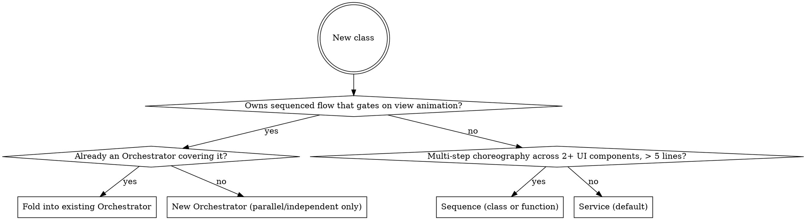

# Minigame Scene Convention

A folder + role + communication recipe for TypeScript projects where each minigame is a scene inside a larger app. Gameplay flow reads top-to-bottom in a single Orchestrator method, animation gating is explicit, and adding meta features is mechanical.

## TL;DR — the mental model

**3 roles** (default to Service when in doubt):

| Role | What it owns | How many per game |
|---|---|---|
| **Service** | State + queries + standalone state-change hooks | Many (wallet, board, quest, tray, grid, ...) |
| **Sequence** | One-shot cross-system choreography (no state, no hooks) | A few; inline if ≤ 5 lines AND ≤ 2 UI components |
| **Orchestrator** | Sequenced gameplay flow that gates on view animation | Usually 1, occasionally 2 (parallel flows) |

**3 communication shapes:**

| Direction | Mechanism |
|---|---|
| Logic → view | `on<PastTense>?: (d) => Promise<void>` hook field. `await` gates flow, `void` is cosmetic. |
| View → logic | Direct method call via DI (constructor injection of logic service). |
| Logic ↔ logic | Direct call. EventBus reserved for N-to-1 ambient listeners (analytics, achievements, ambient audio). |

**1 folder shape:** `games/<gameName>/{logic/, view/, config/, <Game>Scene.ts}` — composition root is the Scene.

**Apply when:** turn-based, sequential, or input-driven minigames (puzzle, match, placement, casual).
**Don't apply when:** real-time loops, replay/undo (immutable state), no animation gating, massive multi-flow scenes. See "When this does not apply" below.

## When invoked

For any task that creates or modifies code inside a minigame folder:

1. Identify the game (folder) the task targets. If creating a new game, plan its folder before touching files.
2. For each new class, run the role decision tree below. Default to Service.
3. Place the class in the folder dictated by its role and feature.
4. Wire communication per the contract: hooks from logic, DI from view, EventBus only for the rare N-to-1 case.
5. After scaffolding, do the reading test (see `references/code-review.md` → Reading test).

## Roles

### Service (default — most code)

Holds state, exposes queries for UI, emits hooks for *standalone* state changes — changes that no Orchestrator step needs to `await` (see "Hook ownership" below). No flow. No awaits between own steps. Lifetime = session.

```ts
class CoinWallet {
    onCoinsAdded?: (d: { amount: number; newBalance: number }) => Promise<void>;
    private balance_ = 0;

    get balance(): number { return this.balance_; }                    // query
    add(amount: number): void {                                        // command
        this.balance_ += amount;
        void this.onCoinsAdded?.({ amount, newBalance: this.balance_ });
    }
}
```

Examples: `CoinWallet`, `QuestTracker`, `Board`, `Tray`, `Grid`, `BoosterInventory`. `AudioManager`, `InputManager` are also Services if they fit the role — the smell is role-mix, not the name. Data model classes (`Tile`, `Block`, `Cell`) are also Services if they hold state, even when they expose no hooks.

### Sequence — cross-system choreography

A one-shot script that sequences awaited steps across multiple UI components, and may call into logic services to commit state at controlled visual moments. No persistent state, no hook fields. Single `play(): Promise<void>` method.

Sequence is the controlled exception to "View doesn't write logic state" — it explicitly coordinates logic + view across time.

When to extract vs inline:

- **Inline** in a view hook handler or Scene `create()` when choreography is ≤ 5 lines AND uses ≤ 2 UI components.
- **Extract** when > 5 lines OR 3+ UI components OR multiple logic services need DI.

Function vs class:

- Free function `playLevelClear(deps, args): Promise<void>` for ≤ 3 DI args.
- Class for 4+ DI args or multiple `play*` methods sharing dependencies.

A Sequence holds DI references but does NOT own logic state and does NOT have hooks. For the full `LevelClearSequence` and shape variations, see `references/examples.md` → Sequence examples.

### Orchestrator — the gameplay spine

A long-lived class owning a sequenced gameplay flow that gates on view animation. Awaits hooks between logic steps so the view animates before the next mutation. The method must read top-to-bottom as the entire gameplay moment.

```ts
class BlockBlastOrchestrator {
    onBlockPlaced?: (d: PlacementResult) => Promise<void>;
    onLinesCleared?: (d: ClearResult & { score: number }) => Promise<void>;
    private locked = false;

    async placeBlock(slot: number, ox: number, oy: number): Promise<void> {
        if (this.locked) return;
        this.locked = true;
        try {
            const cells = this.grid.place(/* ... */);
            await this.onBlockPlaced?.({ /* ... */ });
            // line clear, scoring, wallet credit, tray refill, game over check ...
        } finally {
            this.locked = false;   // released even if a hook handler threw
        }
    }
}
```

For the full implementation with scoring, wallet credit, refill, and game-over flow, see `references/examples.md` → Orchestrator examples.

**One Orchestrator per coherent sequenced flow that gates on view.** Most minigames have exactly one (the core gameplay loop). A few have two — e.g., turn-based core + a parallel cinematic flow. The cap is functional: *"does this thing own a sequenced flow that genuinely gates on view animation?"* If no → Service. Games where every input gives instant feedback with cosmetic-only animation have zero Orchestrators.

### Decision tree



"Fold into existing Orchestrator" means add the new flow as another method on the current Orchestrator class — the spine is already there; adding to it keeps the gameplay moment readable in one place. If unsure, choose Service. Promotion later is easy; demotion is painful.

## Hook ownership: Service or Orchestrator?

Both Services and Orchestrators may expose hooks. The classification is **not** "who owns the state" — it's **whether the Orchestrator's next logic step depends on the view finishing this moment**.

| Hook lives on… | When the moment is… | Examples |
|---|---|---|
| **Orchestrator** | Part of a sequenced flow — Orchestrator must `await` before its next logic step | `onBlockPlaced` (then clear lines), `onLinesCleared` (then credit wallet), `onBoardFull` (then game over) |
| **Service** | Standalone state-change notification — no downstream logic gates on it; only view reacts | `onCoinsAdded` (coin flight), `onQuestCompleted` (popup), `onLivesRefilled` (HUD badge) |

Test when in doubt: *"After this hook resolves, does the Orchestrator method have a next line that depends on view work being done?"*

- **Yes** → Orchestrator emits. The Service stays a pure state holder with synchronous methods.
- **No** → Service emits. Orchestrator never references the hook; only views bind it.

Example — `onBoardFull` belongs to the Orchestrator, not the `Board` Service:

```ts
async dropTile(slot: number, pos: Pos): Promise<void> {
    if (this.locked) return;
    this.locked = true;
    try {
        this.board.place(slot, pos);                       // Service: pure mutation, no hook
        await this.onTilePlaced?.({ pos });                // gate: tile-drop anim

        if (this.board.isFull()) {                         // Service: query
            await this.onBoardFull?.({ board: this.board.snapshot() });
            await this.onGameOver?.({ score: this.score });
        }
    } finally {
        this.locked = false;
    }
}
```

`Board` is a Service but emits no hook here. Orchestrator calls `place()` synchronously, queries `isFull()`, then emits both gating hooks itself. The whole drop-tile moment stays readable in one method. For the full class with field declarations, see `references/examples.md` → BoardOrchestrator.

**Don't double-emit the same moment.** If a change is part of gameplay flow *and* useful as a standalone notification, pick one — usually Orchestrator owns the gating hook and the Service stays hook-less for that change.

## Communication

### Logic → view: hooks

- **Past-tense names** (`onCoinsAdded`, `onMatchSucceeded`, `onLevelCleared`) — describe what logic just committed, not what view should do next.
- **Single data-object param** `(d: { ... })` — never positional. Adding a field later doesn't break bindings.
- `Promise<void>` gates the flow (logic awaits). `void hook?.(...)` is fire-and-forget cosmetic feedback. A throwing handler propagates rejection to the awaiting logic call — the Orchestrator releases its `locked` flag in `finally`.
- **One hook field = one binder.** For N consumers reacting to the same moment, the Scene wires the lambda with `Promise.all`.
- **Extract payload to a named `interface`** when reused at 2+ binding sites, has 4+ fields, or hurts readability. Inline `(d: { ... })` is fine for single-use low-arity payloads.
- Logic never imports engine APIs. World coordinates ride as opaque data on hook payloads; view does the engine-specific translation.

View binds and unbinds:

```ts
class CoinBarView {
    constructor(private wallet: CoinWallet) {}
    bind(): void {
        this.wallet.onCoinsAdded = async ({ amount, newBalance }) => {
            await this.flight.fly(this.startPos, this.barPos, amount);
            this.label.setText(String(newBalance));
        };
    }
    unbind(): void { this.wallet.onCoinsAdded = undefined; }
}
```

### View → logic: direct calls via DI

View constructors receive logic services. View calls query methods to render and command methods to forward user input.

- Pure logic functions (`PlacementValidator.canPlace`, `PathFinder.find`) can be called from view directly — they are read-only queries.
- **Service query getters returning a collection must return `readonly`** — view calling `service.someList.push(...)` would mutate logic state by reference and silently bypass the hook contract.
- **Pure View classes** command logic only in response to user input. They do not mutate logic state from inside a hook handler. **Sequences are the explicit exception.**

### Logic ↔ logic: direct calls

When one logic service must inform another, prefer DI. The Orchestrator (if any) holds references and calls services in order.

Reserve `EventBus` for genuine N-to-1 listeners with no gameplay timing: achievements, analytics, ambient audio. Logic services never emit on EventBus to drive gameplay flow — that order belongs to the Orchestrator.

## Folder shape

```
games/<gameName>/
├── <Game>Scene.ts        # composition root: instantiate + wire
├── logic/                # headless, no engine imports
├── view/                 # engine-side (animations, UI, sounds)
├── config/               # constants, levels
├── assets/
└── index.ts
```

All instances are **per-Scene**: created in the composition root, torn down on Scene shutdown. No singletons inside a game folder. Cross-game persistent data (player wallet, profile) loads from a project-level store and is **injected** into the per-Scene Service at construction.

For the full tree with `logic/core/`, `logic/<metaFeature>/`, `view/sequences/`, allowed variations, and lifetime details, see `references/folder-structure.md`. For the full composition-root recipe (and engine variations beyond Phaser), see `references/composition-root.md`.

## Authority and when this does not apply

User and project instructions take precedence. Before refactoring existing code: surface conflicts to the user; don't unilaterally rewrite. For NEW code without an existing convention, apply this one. For SMALL changes inside an inconsistent system, match local style and flag the divergence — do not hybridize one file.

**Immutability override.** The project default is "create new objects, never mutate". This convention deliberately overrides that **inside `logic/`** — a Service owns mutable state, an Orchestrator uses a `locked` flag, Sequences mutate via DI at controlled visual moments. The contract that replaces immutability is **hook + locking**. Outside `logic/`, the project rule still applies.

**This convention does not apply to:**

- **Real-time games** (action, infinite runner, autoplay physics) — fixed timestep cannot await per-frame view work. Keep `logic/` headless and `<Game>Scene.ts` as composition root, but skip the Orchestrator. View polls logic state per frame.
- **Massive multi-flow scenes** (MMO with combat + chat + party + auction in parallel) — needs different architecture.
- **Games requiring immutable state for replay / undo / time-rewind** — use Redux/MVU instead.
- **Games without animation gating** (auto-resolved flow, idle ticking) — return-style Functional Core / Imperative Shell is simpler.

## Top anti-patterns to recognize

Under deadline pressure these get rationalized. Recognize the excuse, then state the underlying technical reality. See `references/code-review.md` for the full anti-patterns table.

| Excuse | Reality |
|---|---|
| "SessionFlow / GameManager makes the Scene cleaner" | A class that re-binds Orchestrator hooks and fans them out IS the spine — there cannot be two spines. If `create()` is too long, extract `wireXxxScene(scene)` as a free function. |
| "We need WalletOrchestrator because the wallet emits flying coins" | Flying coins are a Service hook (`wallet.onCoinsAdded`) → CoinBarView animation. No sequenced gameplay flow here. Wallet is a Service. |
| "EventBus is more decoupled than hooks" | Decoupling is a means, not a goal. EventBus disperses gameplay order across listeners; the Orchestrator must own that order. Hooks couple intentionally between exactly two parties. |

## Further reading

- `references/folder-structure.md` — default folder + allowed variations + lifetime details.
- `references/composition-root.md` — full Scene example, fan-out patterns, `wireXxxScene` helper, and engine variations (Cocos Creator, PixiJS, Three.js).
- `references/examples.md` — full `BlockBlastOrchestrator` + `BoardOrchestrator` shapes, plus all Sequence variations (class, function, multi-`play*`, inline counter-example).
- `references/code-review.md` — anti-patterns table (canonical) + reading test (Pass/Fail examples).
- `references/heritage.md` — prior art (FC/IS, Hexagonal, Saga, async state machines, Service Layer), stated assumptions, ports/adapters mapping.
