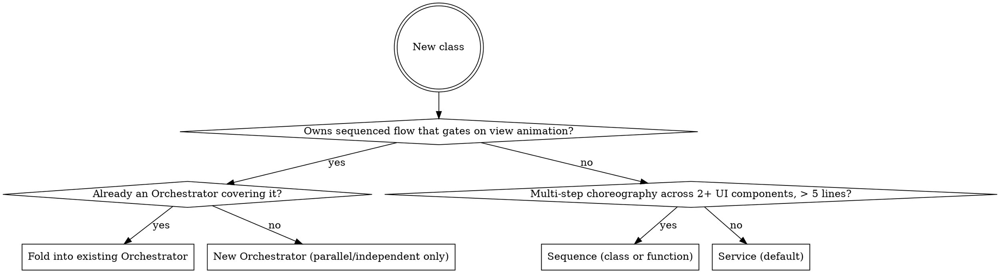

# Minigame Scene Convention

A folder + role + communication recipe for TypeScript projects where each minigame is a scene inside a larger app. The payoff: gameplay flow reads top-to-bottom in a single Orchestrator method, animation gating is explicit, and adding meta features (wallet, quest, booster) is mechanical.

The pattern works for turn-based, sequential, or input-driven minigames (puzzle, match, placement, casual). For real-time games and other excluded cases, see "When this convention does not apply" below.

## When invoked

For any task that creates or modifies code inside a minigame folder:

1. Identify the game (folder) the task targets. If creating a new game, plan its folder before touching files.
2. For each new class, run the role decision tree. Default to Service.
3. Place the class in the folder dictated by its role and feature.
4. Wire communication per the contract: hooks from logic, DI from view, events only for the rare N-to-1 case.
5. After scaffolding, do the reading test (see Quick reference).

## The convention

The convention has three pieces: a communication contract, a role classification, and a folder shape.

### Communication: three shapes

Every interaction between layers takes one of three shapes.

**Logic → UI: hooks.** Logic exposes nullable async hook fields. View binds lambdas. Logic awaits the hook when the next logic step depends on view work finishing.

```ts
class CoinWallet {
    onCoinsAdded?: (d: { amount: number; newBalance: number }) => Promise<void>;

    add(amount: number): void {
        this.balance_ += amount;
        // Hook signature is Promise<void> so other callers can await it,
        // but Wallet doesn't gate its own flow → fire-and-forget with `void`.
        void this.onCoinsAdded?.({ amount, newBalance: this.balance_ });
    }
}

class CoinBarView {
    bind(): void {
        this.wallet.onCoinsAdded = async ({ amount, newBalance }) => {
            await this.flight.fly(this.startPos, this.barPos, amount);
            this.label.setText(String(newBalance));
        };
    }
    unbind(): void { this.wallet.onCoinsAdded = undefined; }
}
```

Hook conventions:

- **Past-tense names** (`onCoinsAdded`, `onMatchSucceeded`, `onLevelCleared`) — describe what logic just committed, not what view should do next.
- **Single data-object param** `(d: { ... })` — never positional. Adding a field later doesn't break bindings.
- `Promise<void>` gates the flow (logic awaits). `void`-called fire-and-forget for cosmetic feedback.
- **One hook field = one binder.** For N consumers reacting to the same moment, the Scene wires the lambda with `Promise.all`.
- **Error semantics:** if a hook handler throws, the rejection propagates to the awaiting logic call. The Orchestrator releases its `locked` flag in a `finally` block. Fire-and-forget (`void hook?.(...)`) deliberately drops rejections — only for cosmetic feedback.
- **Extract payload to a named `interface` or `type`** when the payload is reused at 2+ binding sites, has 4+ fields, or hurts readability. Inline `(d: { ... })` is fine for single-use, low-arity payloads. Derive view-side types with `Parameters<typeof service.onCoinsAdded>` rather than duplicating shapes.
- Logic never imports engine APIs. World coordinates ride as opaque data on hook payloads; view does the engine-specific translation.

**UI → Logic: direct calls via DI.** View constructors receive logic services. View calls query methods to render and command methods to forward user input.

```ts
class CoinBarView {
    constructor(private wallet: CoinWallet) {
        this.label.setText(String(wallet.balance));   // query
    }
    onPurchaseClicked(price: number): void {
        this.wallet.spend(price);                     // command
    }
}
```

- Pure logic functions (`PlacementValidator.canPlace`, `PathFinder.find`) can be called from view directly — they are read-only queries.
- **Service query getters returning a collection must return `readonly`** (e.g., `get activeQuests(): readonly ActiveQuest[]`). View calling `service.someList.push(...)` would mutate logic state by reference and silently bypass the hook contract — `readonly` makes the contract enforceable by the type system.
- **Pure View classes** command logic only in response to user input. They do not mutate logic state from inside a hook handler. **Sequences are the explicit exception** — see Sequence role below.

**Logic ↔ Logic: direct calls.** When one logic service must inform another, prefer DI. The Orchestrator (if any) holds references and calls services in order.

Reserve `EventBus` for genuine N-to-1 listeners with no gameplay timing: achievements, analytics, ambient audio. Logic services never emit on EventBus to drive gameplay flow — that order belongs to the Orchestrator.

### Roles: three classes only

Before writing a class, classify it as one of three roles. Default to Service.

**Service (default — most code).** Holds state, exposes hooks when state changes, exposes queries for UI. No flow. No awaits between own steps. Lifetime equals the session.

Examples: `CoinWallet`, `OnetProgression`, `QuestTracker`, `BoosterInventory`, `Tray`, `Grid`, `Board`. `AudioManager`, `InputManager` are also Services if they fit the role — the smell is role-mix, not the name. Data model classes (`Tile`, `Block`, `Cell`) are also Services if they hold state, even though they have no hooks.

```ts
class QuestTracker {
    onQuestCompleted?: (d: { quest: Quest; reward: Reward }) => Promise<void>;
    private active: ActiveQuest[] = [];

    get activeQuests(): readonly ActiveQuest[] { return this.active; }   // query

    recordMatch(d: MatchResult): void {                                  // command
        for (const q of this.active) {
            if (q.def.kind === 'matchCount' && ++q.progress >= q.def.target) {
                void this.onQuestCompleted?.({ quest: q.def, reward: q.def.reward });
            }
        }
    }
}
```

**Sequence.** A one-shot script for cross-system choreography. No persistent state, no hooks. Single `play()` method that sequences awaited steps across multiple UI components, **and may call into logic services** to commit state at controlled visual moments.

Sequence is the controlled exception to "View doesn't write logic state" — it explicitly coordinates logic + view across time.

```ts
class LevelClearSequence {
    constructor(
        private chest: ChestView, private flight: CoinFlightView, private bar: CoinBarView,
        private wallet: CoinWallet,                  // logic DI — Sequence may write
        private progression: OnetProgression,        // logic DI — Sequence may write
    ) {}

    async play(reward: Reward, level: number): Promise<void> {
        await this.chest.playOpen();
        await this.flight.fly(this.chest.pos, this.bar.pos, reward.coins);
        this.wallet.add(reward.coins);                                     // commit
        const stars = this.progression.applyLevelClear(level, reward.score);
        await this.bar.popup.show(stars);
    }
}
```

When to extract Sequence vs inline:

- **Inline** (in a View hook handler or Scene `create()`) when the choreography is ≤ 5 lines AND uses ≤ 2 UI components. The 5/2 threshold is a proxy for *"choreography is complex enough that gameplay flow leaks into a view hook handler"*. If a view handler starts reading awkwardly, extract before reaching the threshold.
- **Extract** when > 5 lines OR 3+ UI components OR multiple logic services need to be DI'd.

Function vs class:

- Free function `playLevelClear(deps, args): Promise<void>` for ≤ 3 DI args.
- Class for 4+ DI args or multiple `play*` methods sharing dependencies.

A Sequence holds DI references but does NOT own logic state and does NOT have hooks. If callers need to know when it finishes, `play()` returning `Promise<void>` is enough.

**Orchestrator.** A long-lived class owning a sequenced gameplay flow that gates on view animation. Awaits hooks between logic steps so the view animates before the next mutation.

The Orchestrator method must read top-to-bottom as the entire gameplay moment.

```ts
class BlockBlastOrchestrator {
    onBlockPlaced?: (d: PlacementResult) => Promise<void>;
    onLinesCleared?: (d: ClearResult & { score: number; combo: number }) => Promise<void>;
    private locked = false;

    async placeBlock(slot: number, ox: number, oy: number): Promise<void> {
        if (this.locked) return;
        if (!this.canPlaceHere(slot, ox, oy)) return;
        this.locked = true;
        try {
            const cells = this.grid.place(/* ... */);
            await this.onBlockPlaced?.({ /* ... */ });
            // line clear, scoring, wallet credit, tray refill, game over check ...
        } finally {
            this.locked = false;   // released even if a hook handler threw
        }
    }
}
```

For the full implementation showing scoring, wallet credit, tray refill, and game-over flow, see references/orchestrator-example.md.

**One Orchestrator per coherent sequenced flow that gates on view.** Most minigames have exactly one (the core gameplay loop). A few have two — e.g., turn-based core + a parallel cinematic flow. The cap is functional, not numeric: *"does this thing own a sequenced flow that genuinely gates on view animation?"* If yes → Orchestrator. If no → Service.

Games where every input gives instant feedback with cosmetic-only animation have zero Orchestrators — just Services.

### Decision tree



"Fold into existing Orchestrator" means add the new flow as another method on the current Orchestrator class — the Orchestrator already owns the spine; adding to it keeps the gameplay moment readable in one place.

If unsure, choose Service. Promotion later is easy; demotion is painful.

### Folder shape

```
games/<gameName>/
├── <Game>Scene.ts                 # composition root: instantiate + wire
├── logic/                         # headless, no engine imports
│   ├── core/                      # gameplay mechanics + the Orchestrator
│   ├── <metaFeature>/             # one folder per meta service (wallet, quest...)
│   └── events/                    # GameEventBus.ts (only when needed)
├── view/                          # engine-side
│   ├── core/                      # gameplay views
│   ├── <metaFeature>/             # meta UIs mirror logic structure
│   └── sequences/                 # cross-system Sequences
├── config/                        # constants, levels
├── assets/                        # manifest
└── index.ts                       # export Scene + scene key
```

All instances are **per-Scene**: created in the composition root, torn down on Scene shutdown. No singletons inside a game folder. Cross-game persistent data (player wallet, profile, save state) loads from a project-level store and is **injected** into the Service at construction.

For default+allowed variations and lifetime details, see references/folder-structure.md. For the full composition-root recipe, see references/composition-root-example.md.

## Authority and when this does not apply

User and project instructions take precedence. Before refactoring existing code: surface conflicts to the user; don't unilaterally rewrite. For NEW code without an existing convention, apply this one. For SMALL changes inside an inconsistent system, match local style and flag the divergence — do not introduce a hybrid mixing two conventions in one file.

**Immutability override.** The project default is "create new objects, never mutate". This convention deliberately overrides that **inside `logic/`** — a Service owns mutable state, an Orchestrator uses a `locked` flag, Sequences mutate via DI at controlled visual moments. The contract that replaces immutability is **hook + locking** (gameplay order is gated by awaited hooks, not by structural sharing). Outside `logic/`, the project rule still applies. For games requiring immutable state for replay/undo, do not adopt this convention.

**This convention does not apply to:**

- **Real-time games** (action, infinite runner, autoplay physics) — fixed timestep cannot await per-frame view work. Keep `logic/` headless and `<Game>Scene.ts` as composition root, but skip the Orchestrator. View polls logic state per frame.
- **Massive multi-flow scenes** (MMO with combat + chat + party + auction in parallel) — needs different architecture.
- **Games requiring immutable state for replay / undo / time-rewind** — use Redux/MVU instead. Hook + mutable-state model is incompatible with deterministic replay.
- **Games without animation gating** (auto-resolved flow, idle ticking) — return-style Functional Core / Imperative Shell is simpler.

For everything between (puzzle, match, casual, placement, idle with discrete turns, card, runner-with-discrete-decisions): apply the convention.

## Common rationalizations under pressure

Under deadline, "the team already has X", or "this game is special" pressure, the convention is rationalized away in predictable ways. Recognize the excuse, then state the underlying technical reality.

| Excuse | Reality |
|---|---|
| "SessionFlow makes the Scene cleaner" / "It's just one extra layer for clarity" | The Scene's `create()` already has three fan-out patterns (per-view bind, `Promise.all`, Sequence). A class that re-binds Orchestrator hooks and fans them out IS the spine, regardless of name — there cannot be two spines. If `create()` is too long, extract `wireXxxScene(scene)` as a free function — that does not introduce a new role. |
| "BattleManager / GameManager is a 'manager' pattern" | Manager is a name, not a role. If `BattleManager` holds state + hooks + sequenced flow + view-binding spine, it is mixed-role. Decompose: `Battle` (Service) + `BattleOrchestrator` (Orchestrator) + Sequences as needed. |
| "We need WalletOrchestrator because the wallet emits flying coins" | Flying coins are a hook from `wallet.onCoinsAdded` → CoinBarView animation. There is no sequenced gameplay flow here. Wallet is a Service. |
| "EventBus is more decoupled than hooks" | Decoupling is a means, not a goal. EventBus disperses gameplay order across listeners; the Orchestrator must own that order. Hooks couple intentionally and explicitly between exactly two parties. |
| "This game is real-time so we need a different orchestrator pattern" | Real-time games do not have an Orchestrator at all. View polls logic per frame. See "When this convention does not apply." |
| "I'll add `interface IWallet` to make hexagonal explicit" | The hook field's TypeScript signature already IS the port. Adding `interface IWallet { ... }` is ceremony; it does not change behavior and rots when methods are added. |
| "Just this one class can break the convention because [reason]" | If the convention does not fit, change the convention or use a different one (Redux/MVU, return-style FC/IS) — do not hybridize one file. |

For more deviation patterns and the convention's compliant alternative, see references/anti-patterns.md.

## Quick reference

| Question | Answer |
|---|---|
| Where does engine code live? | `view/` only. Never `logic/`. |
| Where do animations live? | `view/` (inline in hook handler) or `view/sequences/` (cross-system, > 5 lines, 3+ UI components). |
| Where does the gameplay loop live? | A single `<Game>Orchestrator` in `logic/core/` (occasionally two for parallel independent flows). |
| Where do meta state classes live? | `logic/<metaFeature>/<Service>.ts`. |
| How does view get data? | DI: constructor injection of logic service, then call query methods. |
| How does logic notify view? | Hook field on the service: `on<PastTenseEvent>?: (d) => Promise<void>`. |
| How does view trigger logic? | DI: call command methods on the injected service, from user-input handlers. |
| How do two views react to one logic moment? | Scene wires the hook lambda with `Promise.all`. |
| When to use EventBus? | N-to-1 listeners (achievements, analytics, ambient audio). Never gameplay flow. |
| When to add an Orchestrator? | Only when there is a sequenced flow that genuinely gates on view animation. Most games have one; some have two. Never per meta feature. |
| Default role for a new class? | Service. Escalate only with explicit reason. |
| Where does a `*Manager` class go? | Wherever its role fits. The name is incidental; role-mix is the smell. |
| Sequence — class or function? | Function for ≤ 3 DI args; class for heavier DI or multiple `play*` methods. |
| Inline choreography or extract Sequence? | Inline if ≤ 5 lines AND ≤ 2 UI components. Extract otherwise. |
| Mutable or immutable state? | Mutable inside `logic/` (override of project default). View, composition root, config, payload values stay immutable. |
| Service query getter returning a collection? | Must return `readonly` — view reads, view doesn't mutate by reference. |
| Inline hook payload `(d: { ... })` or named type? | Inline for single-use low-arity. Extract `interface XxxPayload` when reused at 2+ sites, has 4+ fields, or hurts readability. |
| Reading test? | Open the Orchestrator (or driving Service) method. Read top-to-bottom. If a new reader can't see the entire moment without grepping or chasing listeners, it's over-decomposed. See references/reading-test.md for Pass/Fail examples. |

## Further reading

- `references/heritage.md` — prior art (FC/IS, Hexagonal, Saga, async state machines, Service Layer), stated assumptions, ports/adapters mapping.
- `references/folder-structure.md` — default folder + allowed variations + lifetime details.
- `references/engine-variations.md` — adapting the composition root to Cocos Creator, PixiJS, Three.js.
- `references/composition-root-example.md` — full Scene example, fan-out patterns, `wireXxxScene` helper for long `create()` methods.
- `references/orchestrator-example.md` — full `BlockBlastOrchestrator.placeBlock` showing `try/finally` re-entry safety, scoring, wallet credit, tray refill, and game-over flow.
- `references/anti-patterns.md` — common deviations, the layer they violate, and the convention's compliant alternative.
- `references/reading-test.md` — Pass/Fail examples for the post-scaffolding sanity check.
