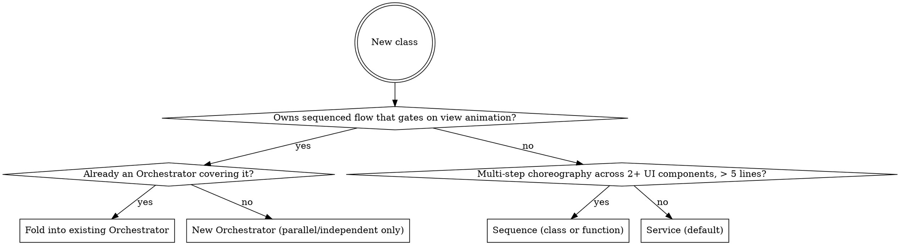

# Minigame Scene Convention

A folder + role + communication contract for TypeScript projects where each minigame is a scene inside a larger app. The convention has two non-negotiable layers and one flexible surface.

- **Layer 1 — Communication contract.** How logic, view, and the engine talk. Rigid.
- **Layer 2 — Role classification.** What each class IS (Service / Sequence / Orchestrator). Rigid.
- **Surface.** Folder names, file granularity, suffix taste. Flexible — any variation is fine as long as Layer 1 and 2 hold.

The pattern works for turn-based, sequential, or input-driven minigames (puzzle, match, placement, casual). For real-time games and other excluded cases, see "When this convention does not apply" at the bottom.

## When invoked

For any task that creates or modifies code inside a minigame folder:

1. Identify the game (folder) the task targets. If creating a new game, plan its folder before touching files.
2. For each new class, run the role decision tree. Default to Service.
3. Place the class in the folder dictated by its role and feature.
4. Wire communication per Layer 1: hooks from logic, DI from view, events only for the rare N-to-1 case.
5. After scaffolding, run the Reading test (see below).

## Authority and conflicts with existing project conventions

User and project instructions take precedence over this convention. Before refactoring existing code:

- If the project already uses a different convention (e.g., a `SessionFlow` central dispatcher, EventBus-driven gameplay, a global service locator), surface the conflict to the user and ask whether they want to migrate, partially adopt, or keep the existing pattern. Do not unilaterally rewrite working code.
- For NEW code that does not yet have a convention, apply this one.
- For SMALL changes inside an inconsistent existing system, match the local style and flag the divergence in your response — do not introduce a hybrid that mixes both conventions in one file.

## Layer 1 — Communication contract

Every interaction between layers takes one of three shapes. No exceptions.

### Logic → UI: hooks

Logic exposes nullable async hook fields. View binds lambdas. Logic awaits the hook when the next logic step depends on view work finishing. Logic does not await when the view reaction is purely cosmetic.

```ts
// Logic side — define hook field
class CoinWallet {
    onCoinsAdded?: (d: { amount: number; newBalance: number; source?: SourceContext }) => Promise<void>;

    add(amount: number, opts?: { source?: SourceContext }): void {
        this.balance_ += amount;
        void this.onCoinsAdded?.({ amount, newBalance: this.balance_, source: opts?.source });
    }
}

// View side — bind lambda in bind() method
class CoinBarView {
    bind(): void {
        this.wallet.onCoinsAdded = async ({ amount, newBalance, source }) => {
            if (source) await this.flight.fly(source.worldPos, this.barPos, amount);
            this.label.setText(String(newBalance));
        };
    }
    unbind(): void { this.wallet.onCoinsAdded = undefined; }
}
```

Rules:

- Hook names are past-tense for the moment that already happened in logic: `onMatchSucceeded`, `onLevelCleared`, `onCoinsAdded`. Never future intent (`onWillMatch`, `onAboutToDie`) — the hook describes what logic just committed, not what view should do next.
- Params always wrapped in a single data object: `(d: { ... }) => Promise<void>`. Never positional. Adding a field later then never breaks an existing binding.
- `Promise<void>` means the hook gates the flow — logic awaits it. `void` means fire-and-forget visual feedback.
- One hook field = one binder. If multiple consumers must react to the same moment, the Scene wires the lambda with `Promise.all` (see references/composition-root-example.md).

### UI → Logic: direct calls via dependency injection

View constructors receive the logic services they need. View calls logic methods directly for queries (read state to render) and commands (forward user input).

```ts
class CoinBarView {
    constructor(private wallet: CoinWallet, private flight: CoinFlightView) {
        this.label.setText(String(wallet.balance));   // query
    }
    onPurchaseClicked(price: number): void {
        this.wallet.spend(price);                       // command
    }
}
```

Rules:

- Pure logic functions (`PlacementValidator.canPlace`, `PathFinder.find`) can be called from view directly — they are read-only queries.
- **Pure View classes** command logic only in response to user input. They do not mutate logic state from inside a hook handler. **Sequences are the explicit exception** — see the Sequence role.

### Logic ↔ Logic: direct calls; events only sparsely

When one logic service needs to inform another, prefer DI. The Orchestrator (if any) holds references to the services it must coordinate and calls them in order.

```ts
async placeBlock(slot: number, ox: number, oy: number): Promise<void> {
    const cleared = this.grid.clearLines(rows, cols);
    this.wallet.add(coinForClear(rows, cols), { source: { worldPos: cellsCenter(cleared) } });
    this.progression.recordClear(cleared);
    this.questTracker.recordClear(cleared);
    await this.onLinesCleared?.({ ... });
}
```

Reserve `EventBus` for genuine N-to-1 cases that have no gameplay timing:

- Achievement tracker listening to many sources.
- Analytics / telemetry.
- Ambient audio / music director.

Rules:

- Logic services NEVER emit on EventBus to drive gameplay flow. Use a hook on the originating service.
- Logic services NEVER import engine APIs. If a service needs world coordinates, accept them as opaque data on the hook payload — view does the engine-specific translation.

## Layer 2 — Role classification

Before writing a class, classify it as one of three roles using the decision tree below.

### Service (default — most code)

A class that holds state, exposes hooks when state changes, and exposes queries (getters) for UI to read. No flow. No awaits between own steps. Lifetime usually equals the session.

Examples: `CoinWallet`, `OnetProgression`, `QuestTracker`, `BoosterInventory`, `Tray`, `Grid`, `Board`. Names like `AudioManager` or `InputManager` are also Services if they fit the role — **the smell is role-mix, never the name**.

```ts
class QuestTracker {
    onQuestCompleted?: (d: { quest: Quest; reward: Reward }) => Promise<void>;
    private active: ActiveQuest[] = [];

    get activeQuests(): readonly ActiveQuest[] { return this.active; }   // query

    recordMatch(d: MatchResult): void {                                  // command
        for (const q of this.active) {
            if (q.def.kind === 'matchCount') {
                q.progress += 1;
                if (q.progress >= q.def.target) this.complete(q);
            }
        }
    }

    private complete(q: ActiveQuest): void {
        void this.onQuestCompleted?.({ quest: q.def, reward: q.def.reward });
    }
}
```

Most code in a game is a Service. Data model classes (`Tile`, `Block`, `Cell`) are also Services in this taxonomy if they hold state, even though they have no hooks.

### Sequence

A one-shot script for cross-system choreography. No persistent state. No hooks. Single `play()` method (or function) that sequences awaited steps across multiple UI components, **and may also call into logic services** to commit state changes at controlled visual moments.

**Sequence is the controlled exception to "View does not write logic state."** A Sequence's defined role IS to coordinate logic + view across time — calling `wallet.add()` in the middle of a chest-opening choreography is the role, not a violation.

Examples: `ComboSequence`, `LevelClearSequence`, `GameOverSequence`, `ChestOpenSequence`.

```ts
class LevelClearSequence {
    constructor(
        private chest: ChestView,
        private flight: CoinFlightView,
        private bar: CoinBarView,
        private popup: LevelUpPopup,
        private wallet: CoinWallet,                  // logic DI — Sequence may write
        private progression: OnetProgression,        // logic DI — Sequence may write
    ) {}

    async play(reward: Reward, level: number): Promise<void> {
        await this.chest.playOpen();
        await this.flight.fly(this.chest.pos, this.bar.pos, reward.coins);
        this.wallet.add(reward.coins);                  // commit at the right visual moment
        const stars = this.progression.applyLevelClear(level, reward.score);
        await this.popup.show(stars);
        await this.popup.dismiss();
    }
}
```

**When to extract a Sequence vs inline:**

- **Inline** (in a View hook handler or Scene `create()`) when the choreography is ≤ 5 lines AND uses ≤ 2 UI components.
- **Extract** when the choreography exceeds 5 lines OR touches 3+ UI components OR needs DI of multiple logic services.

**Class vs function:**

- A free function `playLevelClear(deps, args): Promise<void>` is fine when DI is short (≤ 3 args).
- A class earns its place when DI is heavier (4+) or you need multiple `play*` methods sharing the same dependencies.

A Sequence may hold DI references to logic services, but does NOT own logic state and does NOT have hooks of its own. If outside callers need to know when it finishes, `play()` returns `Promise<void>` — that is enough.

### Orchestrator

A long-lived class that owns a sequenced gameplay flow gating on view animation. Awaits hooks between logic steps so the view runs animation before the next mutation.

**One Orchestrator per coherent sequenced flow gating on view.** Most minigames have exactly one (the core gameplay loop). Some games legitimately have two — e.g., a turn-based core + a parallel cinematic flow that fires on rare conditions. The cap is functional, not numeric: the test is *"does this thing own a sequenced flow that genuinely gates on view animation?"* If yes, Orchestrator. If no, Service.

If a game has no view-gated sequenced flow (every input gives instant feedback with only cosmetic animation), it has zero Orchestrators — just Services.

The Orchestrator method must read top-to-bottom as the entire gameplay moment.

```ts
class BlockBlastOrchestrator {
    onBlockPlaced?: (d: PlacementResult) => Promise<void>;
    onLinesCleared?: (d: ClearResult & { score: number; combo: number }) => Promise<void>;
    onTrayRefilled?: (d: { blocks: BlockShape[] }) => Promise<void>;
    onGameOver?: (d: { score: number; reason: GameOverReason }) => Promise<void>;

    private locked = false;
    private combo = 0;
    private score = 0;

    constructor(
        private grid: Grid, private tray: Tray, private shapes: ShapeFactory,
        private wallet: CoinWallet, private progression: BlockBlastProgression,
    ) {}

    async placeBlock(slot: number, ox: number, oy: number): Promise<void> {
        if (this.locked) return;
        const block = this.tray.peek(slot);
        if (!block || !PlacementValidator.canPlace(this.grid, block, ox, oy)) return;
        this.locked = true;

        const cells = this.grid.place(block, ox, oy);
        this.tray.consume(slot);
        await this.onBlockPlaced?.({ block, cells, slot });

        const clears = LineClearer.findClears(this.grid);
        if (clears.rows.length || clears.cols.length) {
            const cleared = this.grid.clearLines(clears.rows, clears.cols);
            const score = scoreForClear(clears, this.combo);
            this.combo += 1;
            this.score += score;
            this.wallet.add(coinForClear(clears), { source: { worldPos: centroid(cleared) } });
            await this.onLinesCleared?.({ ...clears, cells: cleared, score, combo: this.combo });
        } else {
            this.combo = 0;
        }

        // tray refill, game over check ...
        this.locked = false;
    }
}
```

Rules:

- The Orchestrator holds a `locked` flag (or equivalent) to prevent re-entry while an awaited hook is mid-animation.
- The Orchestrator owns the gameplay state machine. It calls into other Services via DI when those Services must update as part of the flow.
- **The Orchestrator IS the spine** of gameplay flow. Do not stack a second spine on top — see Anti-patterns. Each view binds the orchestrator hooks it cares about directly; meta services are updated by the Orchestrator's logic-side calls.

### Decision tree for new classes



If unsure, choose Service. Promotion later is easy; demotion is painful.

## Folder structure (default shape)

```
games/<gameName>/
├── <Game>Scene.ts                 # composition root: instantiate + wire
├── logic/                         # headless, no engine imports
│   ├── core/                      # gameplay mechanics + the Orchestrator
│   │   ├── <DomainNoun>.ts        # Board, Grid, Tile, Tray ...
│   │   ├── <PureFunc>.ts          # PathFinder, PlacementValidator ...
│   │   ├── rules.ts
│   │   ├── types.ts
│   │   └── <Game>Orchestrator.ts
│   ├── <metaFeature>/             # one folder per meta service
│   │   └── <Service>.ts           # Wallet, Progression, QuestTracker ...
│   └── events/
│       └── GameEventBus.ts        # only when needed; sparse use
├── view/                          # engine-side
│   ├── core/                      # gameplay views
│   │   └── <View>.ts              # BoardView, GridView, TrayView ...
│   ├── <metaFeature>/             # meta UIs mirror logic structure
│   │   └── <View>.ts              # CoinBarView, QuestPanelView ...
│   └── sequences/                 # cross-system Sequences
│       └── <Sequence>.ts          # ComboSequence, LevelClearSequence ...
├── config/
│   ├── constants.ts
│   ├── levels.ts
│   └── ...
├── assets/
│   └── manifest.ts
└── index.ts                       # export Scene + scene key
```

### Allowed variations (do not break convention)

- Split `logic/core/` into `logic/model/` (data shapes) + `logic/logic/` (mechanics) when data is heavy.
- Split `view/` into `view/widgets/` (reusable primitives), `view/popups/`, `view/screens/`, `view/hud/`.
- Merge tiny meta features into one folder when they are trivially small.
- Different suffix taste (`*Service` vs none, `*View` vs `*Panel` vs `*Widget`) as long as it is consistent within the project.
- Different file granularity — one `BoardView.ts` versus `BoardView.ts` + `CellView.ts` + `GridLineView.ts` — based on complexity.

The test for any variation: *Does it violate Layer 1 or Layer 2?* If no, it is allowed.

## Composition root: the Scene

Every game has exactly one Scene file at `games/<gameName>/<Game>Scene.ts`. The Scene is the only place that knows about every part. It instantiates logic, the Orchestrator, and views; binds hooks; wires Sequences; wires input; and tears down on shutdown.

For the full code shape, fan-out patterns, the `wireXxxScene(scene)` helper for long `create()` methods, and engine variations (Cocos / Pixi / Three.js), see references/composition-root-example.md and references/engine-variations.md.

If `create()` exceeds ~100 lines, extract a free function `wireXxxScene(scene)` — do NOT introduce a `SceneFlow` / `SessionFlow` class (see Anti-patterns).

## Anti-patterns to refuse

When asked to write code that violates these, refuse and propose the convention-compliant alternative. Explain which contract layer is violated.

| Anti-pattern | Violation | Replace with |
|---|---|---|
| Spine **on top of** the Orchestrator (SessionFlow / central dispatcher binding orchestrator hooks and fanning out to view + meta + observers) | Layer 2 (the Orchestrator IS already the spine; this is a double spine) | Each view binds its own logic service's hooks. Sequences for cross-system moments. Scene's `create()` for `Promise.all` cases. |
| Mixed-role class (hooks + state + sequenced flow + view-binding-spine all in one) — regardless of name | Layer 2 (role-mix) | Decompose by role into Service(s) + Orchestrator + Sequence as needed. Naming is incidental. |
| Orchestrator for a feature that is a Service (`WalletOrchestrator`, `QuestOrchestrator`) | Layer 2 (Service mis-classified) | Demote to Service. Apply the decision tree. |
| EventBus driving gameplay (`EventBus.emit('match_made')` to notify view of a state change) | Layer 1 (logic→UI must be hook) | Add a hook field on the originating logic service. |
| Logic class importing engine (`import * as Phaser from 'phaser'` inside `logic/`) | Layer 1 (logic must be headless) | Move engine code to a corresponding View. Logic carries opaque payloads (`Vec2`, indices); view translates. |
| Pure View class mutating logic state from inside a hook handler | Layer 1 (pure View hook handlers are animation only) | Either move the mutation to the Orchestrator's logic flow (before/after the hook), or recognize this is actually a Sequence and extract it. |
| Hook named for future intent (`onWillDie`, `onAboutToMatch`) | Layer 1 (hooks describe past logic events) | Rename to past-tense (`onUnitDied`, `onMatchSucceeded`). |
| Positional hook parameters (`onUnitDamaged?: (unit, value) => void`) | Layer 1 (params must be wrapped object) | Wrap in `{ unit, value }` data object. |

## Common rationalizations to refuse

Under pressure (deadline, "the team already has SessionFlow", "this game is special"), agents tend to rationalize their way out of the convention. Recognize these excuses and respond with the listed reality.

| Excuse | Reality |
|---|---|
| "SessionFlow makes the Scene cleaner" / "It's just one extra layer for clarity" | The Scene's `create()` already has three fan-out patterns (per-view bind, `Promise.all`, Sequence). A class that re-binds Orchestrator hooks and fans them out IS the spine, regardless of name — you cannot add a second spine "for clarity." If `create()` is too long, extract `wireXxxScene(scene)` as a free function — that does not introduce a new role. |
| "BattleManager / GameManager is a 'manager' pattern" | Manager is a name, not a role. If `BattleManager` holds state + hooks + sequenced flow + view-binding spine, it is mixed-role. Decompose by role: `Battle` (Service) + `BattleOrchestrator` (Orchestrator) + Sequences as needed. |
| "We need WalletOrchestrator because the wallet emits flying coins" | Flying coins are a hook from `wallet.onCoinsAdded` → CoinBarView animation. There is no sequenced gameplay flow here. Wallet is a Service. |
| "EventBus is more decoupled than hooks" | Decoupling is a means, not a goal. EventBus disperses gameplay order across listeners; the Orchestrator must own that order. Hooks couple intentionally and explicitly between exactly two parties. |
| "This game is real-time so we need a different orchestrator pattern" | Real-time games do not have an Orchestrator at all. View polls logic per frame. See "When this convention does not apply." |
| "I'll add `interface Port` declarations to make hexagonal explicit" | The hook field's TypeScript signature already IS the port. Adding `interface IWallet { ... }` is ceremony; it does not change behavior and rots when methods are added. |
| "Just this one class can break the convention because [reason]" | Violating the letter of the rules is violating the spirit of the rules. If the convention does not fit, change the convention or use a different one (Redux/MVU, return-style FC/IS) — do not hybridize one file. |

## Reading test (sanity check after scaffolding)

After scaffolding any feature touching the gameplay loop, open the Orchestrator method (or, if no Orchestrator, the Service method that drives the moment) and read top-to-bottom. A new reader must see the entire moment without grepping event names, opening other files, or chasing listeners.

If a private method called from the Orchestrator hides essential gameplay flow, inline it OR rename so the call site is self-explanatory (e.g., `this.applyLineClearScoring(clears)` is fine; `this.handleStuff(clears)` is not).

If they cannot, the feature is over-decomposed. Consolidate.

## Quick reference

| Question | Answer |
|---|---|
| Where does engine code live? | `view/` only. Never `logic/`. |
| Where do animations live? | `view/` (inline in hook handler) or `view/sequences/` (cross-system, > 5 lines, 3+ UI components). |
| Where does the gameplay loop live? | A single `<Game>Orchestrator` in `logic/core/` (occasionally two for parallel independent flows). |
| Where do meta state classes live? | `logic/<metaFeature>/<Service>.ts`. |
| How does view get data? | DI: constructor injection of logic service, then call query methods. |
| How does logic notify view? | Hook field on the service: `on<PastTenseEvent>?: (d) => Promise<void>`. |
| How does view trigger logic? | DI: call command methods on the injected service, from user-input handlers. |
| How do two views react to one logic moment? | Scene wires the hook lambda with `Promise.all`. |
| When to use EventBus? | N-to-1 listeners (achievements, analytics, ambient audio). Never gameplay flow. |
| When to add an Orchestrator? | Only when there is a sequenced flow that genuinely gates on view animation. Most games have one; some have two. Never per meta feature. |
| Default role for a new class? | Service. Escalate only with explicit reason. |
| Where does a `*Manager` class go? | Wherever its role fits. The name is incidental; role-mix is the smell. |
| Sequence — class or function? | Function for ≤ 3 DI args; class for heavier DI or multiple `play*` methods. |
| Inline choreography or extract Sequence? | Inline if ≤ 5 lines AND ≤ 2 UI components. Extract otherwise. |
| Mutable or immutable state? | Mutable (this convention's assumption). For immutable + replay/undo, use Redux/MVU instead. |

## When this convention does not apply

This convention is for input-driven, turn-based, or sequential minigames where the orchestrator can `await` between logic steps. It does NOT apply cleanly to:

- **Real-time games** (action, infinite runner, autoplay physics) — logic runs on a fixed timestep and cannot await per-frame view work. Keep `logic/` headless and `<Game>Scene.ts` as composition root, but skip the Orchestrator. View polls logic state per frame.
- **Massive multi-flow scenes** (MMO scenes with combat + chat + party + auction in parallel) — needs a different architecture; this convention does not extend.
- **Games requiring immutable state for replay / undo / time-rewind** — use Redux/MVU-style architecture instead. The hook + mutable-state model is incompatible with deterministic replay.
- **Games without animation gating** (auto-resolved flow, idle ticking) — return-style Functional Core / Imperative Shell is simpler. Do not force this convention onto it.

For everything between (puzzle, match, casual, placement, idle with discrete turns, card, runner-with-discrete-decisions): apply the convention.

## Further reading

- `references/heritage.md` — prior art (FC/IS, Hexagonal, Saga, async state machines, Service Layer), stated assumptions (mutable state, hook-style trade-off), ports/adapters mapping.
- `references/engine-variations.md` — adapting the composition root to Cocos Creator, PixiJS, Three.js.
- `references/composition-root-example.md` — full Scene example, fan-out patterns, `wireXxxScene` helper for long `create()` methods.
